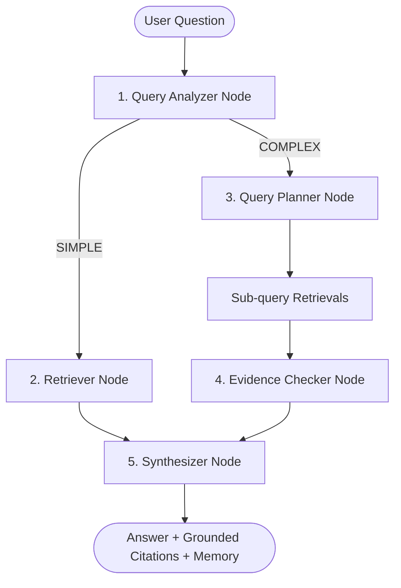

# DocuAgent — Agentic RAG Document Assistant

DocuAgent is a lightweight, production-oriented **Agentic RAG (Retrieval-Augmented Generation) Document Assistant** built with **Python 3.12**, **FastAPI**, **PostgreSQL + pgvector**, **LangGraph**, **Hugging Face Sentence-Transformers**, and **Groq**.

Users can upload documents (**PDF**, **Markdown**, **TXT**) and ask simple or complex multi-part questions with conversational memory and verifiable page-level citations.

---

## 1. Why Agentic RAG over Basic RAG?

### Basic RAG (Naive):
```text
Question ──► Embedding ──► Vector Search ──► Context ──► LLM ──► Answer
```
* **Limitation**: Fails on comparative queries (e.g. *"Compare Section A and Section B"*), multi-step questions, or queries that need sub-topic decomposition.

### DocuAgent (Agentic RAG):


1. **`query_analyzer`**: Analyzes the question and routes simple questions to direct retrieval and complex questions to planning.
2. **`query_planner`**: Decomposes complex questions into focused sub-queries and retrieves chunks for each.
3. **`evidence_checker`**: Verifies that the retrieved context has sufficient information.
4. **`synthesizer`**: Formats conversation history, calls Groq LLM, and appends verifiable citations (`[1] filename.pdf — Page X`).

---

## 2. Tech Stack

- **Backend**: Python 3.12+, FastAPI, Pydantic v2
- **Database**: PostgreSQL 16 with `pgvector` (`Vector(384)`)
- **ORM**: SQLAlchemy 2.0 (Async with `asyncpg`)
- **Agent Framework**: LangGraph & LangChain Core
- **LLM**: Groq Cloud (`llama-3.3-70b-versatile` / `llama-3.1-8b-instant`) — Free fast inference
- **Embeddings**: Hugging Face `sentence-transformers` (`all-MiniLM-L6-v2`) — 100% Free & Local
- **Document Processing**: `pypdf` for page-aware extraction
- **Testing**: `pytest` & `pytest-asyncio`
- **Containers**: Docker & Docker Compose

---

## 3. Project Structure

```text
DocuAgent/
├── app/
│   ├── main.py              # FastAPI app, lifespan, CORS & static frontend mounting
│   ├── config.py            # Pydantic Settings for environment variables
│   ├── database.py          # SQLAlchemy async engine, sessionmaker & Base
│   │
│   ├── models/              # Database Models
│   │   ├── document.py      # Document model (id, filename, file_path, created_at)
│   │   ├── chunk.py         # Chunk model (content, page_number, Vector(384))
│   │   └── conversation.py  # Conversation & Message models for memory
│   │
│   ├── routes/              # API Endpoints
│   │   ├── documents.py     # POST /documents/upload, GET /documents
│   │   └── chat.py          # POST /chat, GET /chat/conversations/{id}
│   │
│   ├── services/            # Core Business Logic
│   │   ├── ingestion.py     # Multi-format text extraction & chunking
│   │   ├── embedding.py     # Local SentenceTransformer embeddings
│   │   ├── retrieval.py     # pgvector cosine similarity search
│   │   └── llm.py           # Groq LLM client & prompt construction
│   │
│   └── agents/              # LangGraph Agentic Workflow
│       ├── state.py         # AgentState TypedDict
│       ├── nodes.py         # 5 LangGraph node implementations
│       └── graph.py         # StateGraph assembly & execution
│
├── frontend/                # Lightweight Modern UI (HTML5, Vanilla CSS, JS)
│   ├── index.html           # Semantic Single-Page Dashboard
│   ├── styles.css           # Soft Light Theme Design System
│   └── app.js               # Reactive Chat & Document Management
│
├── tests/                   # Pytest test suite (20 unit & API tests)
├── uploads/                 # Uploaded document storage
├── Dockerfile
├── docker-compose.yml
├── requirements.txt
├── .env.example
└── README.md
```

---

## 4. Quickstart Guide

### Prerequisites
- Python 3.12+ (or Docker)
- A free [Groq API Key](https://console.groq.com/keys)

### Option A: Running with Docker Compose (Recommended)

1. Clone the repository:
   ```bash
   git clone https://github.com/krishu2814/DocuAgent.git
   cd DocuAgent
   ```

2. Configure `.env`:
   ```bash
   cp .env.example .env
   ```
   Add your Groq API key in `.env`:
   ```env
   GROQ_API_KEY=gsk_your_groq_api_key_here
   ```

3. Start PostgreSQL with pgvector and the FastAPI API:
   ```bash
   docker compose up --build
   ```

4. The API is live at `http://localhost:8000`. Interactive docs: `http://localhost:8000/docs`.

---

### Option B: Running Locally with Python

1. Create and activate a virtual environment:
   ```bash
   python3 -m venv .venv
   source .venv/bin/activate
   ```

2. Install dependencies:
   ```bash
   pip install -r requirements.txt
   ```

3. Start a PostgreSQL container with pgvector:
   ```bash
   docker run -d --name pgvector-db -p 5432:5432 \
     -e POSTGRES_USER=postgres \
     -e POSTGRES_PASSWORD=postgres \
     -e POSTGRES_DB=docuagent \
     pgvector/pgvector:pg16
   ```

4. Run the FastAPI development server:
   ```bash
   uvicorn app.main:app --reload --port 8000
   ```

---

## 5. API Endpoints & Example Usage

### 1. Health Check
```bash
curl http://localhost:8000/health
```

### 2. Upload Document (PDF / TXT / Markdown)
```bash
curl -X POST http://localhost:8000/documents/upload \
  -F "file=@sample_architecture.pdf"
```

### 3. List Ingested Documents
```bash
curl http://localhost:8000/documents
```

### 4. Ask a Question (Agentic RAG with Memory & Citations)
```bash
curl -X POST http://localhost:8000/chat \
  -H "Content-Type: application/json" \
  -d '{
    "question": "What authentication mechanism is used in the system?"
  }'
```

**Response:**
```json
{
  "conversation_id": "3b185f52-b13c-473d-82d2-8b389656e185",
  "question": "What authentication mechanism is used in the system?",
  "answer": "The system uses JSON Web Tokens (JWT) for stateless authentication across microservices.\n\nSources:\n[1] sample_architecture.pdf — Page 4",
  "sources": [
    {
      "content": "Authentication is handled via signed JWT tokens...",
      "page_number": 4,
      "source": "sample_architecture.pdf"
    }
  ]
}
```

### 5. Multi-Turn Follow-up Question
```bash
curl -X POST http://localhost:8000/chat \
  -H "Content-Type: application/json" \
  -d '{
    "conversation_id": "3b185f52-b13c-473d-82d2-8b389656e185",
    "question": "Why was it chosen over session cookies?"
  }'
```

---

## 6. Running Tests

Run the complete test suite:
```bash
pytest -v
```

All 20 test cases covering configuration, text extraction, chunking, embeddings, pgvector retrieval, LangGraph routing, memory, and citations pass:
```text
tests/test_agents.py::test_analyze_query_node_simple PASSED              [  5%]
tests/test_agents.py::test_analyze_query_node_complex PASSED             [ 10%]
tests/test_agents.py::test_evidence_checker_node PASSED                  [ 15%]
tests/test_agents.py::test_synthesizer_appends_citations PASSED          [ 20%]
tests/test_agents.py::test_route_by_query_type PASSED                    [ 25%]
tests/test_agents.py::test_rag_graph_all_5_nodes_exist PASSED            [ 30%]
tests/test_config.py::test_settings_defaults PASSED                      [ 35%]
tests/test_config.py::test_settings_production_mode PASSED               [ 40%]
tests/test_document_routes.py::test_upload_unsupported_file_type_returns_400 PASSED [ 45%]
tests/test_document_routes.py::test_get_nonexistent_document_returns_404 PASSED [ 50%]
tests/test_embeddings_smoke.py::test_huggingface_local_embedding_dimension PASSED [ 55%]
tests/test_health.py::test_health_check PASSED                           [ 60%]
tests/test_health.py::test_not_found_endpoint PASSED                     [ 65%]
tests/test_ingestion.py::test_extract_text_file PASSED                   [ 70%]
tests/test_ingestion.py::test_extract_markdown_file PASSED               [ 75%]
tests/test_ingestion.py::test_unsupported_file_format_raises_error PASSED [ 80%]
tests/test_ingestion.py::test_split_text_into_chunks PASSED              [ 85%]
tests/test_ingestion.py::test_process_file_into_chunks PASSED            [ 90%]
tests/test_rag.py::test_generate_rag_answer_with_chat_history PASSED     [ 95%]
tests/test_rag.py::test_chat_empty_question_returns_400 PASSED           [100%]

============================== 20 passed in 6.52s ==============================
```

---

## 7. Key Interview Talking Points

1. **Why LangGraph over simple LangChain chains?**
   - Traditional chains execute strictly linearly (`A -> B -> C`). LangGraph allows building state machines with conditional loops, query analysis, branching (simple vs. complex), and evidence verification.

2. **How does pgvector integrate with SQLAlchemy?**
   - We store chunk vectors using `pgvector.sqlalchemy.Vector(384)`. Similarity searches run native PostgreSQL cosine distance queries (`DocumentChunk.embedding.cosine_distance(query_vector)`), utilizing database indexes for sub-millisecond retrieval.

3. **How are citations kept factual?**
   - The LLM does not invent citation metadata. Every chunk stored in pgvector retains its original document filename and page number from `pypdf`. The citations section is constructed directly by the backend from the chunks actually retrieved.

---
